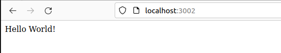

# ece-devops-project-Bonnefond-Freisz

## 1. Créer une application Web

Il s'agit d'une application nodejs qui stocke les données sur une base de données Redis.
C'est une application implémentant une api avec une fonctionnalité d'utilisateurs CRUD.

Ainsi qu'une base de donnée via Redis.

Et toute une série de Tests.

En voici quelque exemple :

```js

  describe('Create', () => {

    it('create a new user', (done) => {
      const user = {
        username: 'erwanb',
        firstname: 'Erwan',
        lastname: 'Bonnefond'
      }
      userController.create(user, (err, result) => {
        expect(err).to.be.equal(null)
        expect(result).to.be.equal('OK')
        done()
      })
    })

    it('passing wrong user parameters', (done) => {
      const user = {
        firstname: 'Erwan',
        lastname: 'Bonnefond'
      }
      userController.create(user, (err, result) => {
        expect(err).to.not.be.equal(null)
        expect(result).to.be.equal(null)
        done()
      })
    })
  
    it('avoid creating an existing user', (done)=> {
      const user = {
        username: 'erwanb',
        firstname: 'Erwan',
        lastname: 'Bonnefond'
      }
      // Create a user
      userController.create(user, () => {
        // Create the same user again
        userController.create(user, (err, result) => {
          expect(err).to.not.be.equal(null)
          expect(result).to.be.equal(null)
          done()
        })
      })
    })
  })
```

ou encore

```js
describe('GET /user', () => {
    
    it('get an existing user', (done) => {
      const user = {
        username: 'erwanb',
        firstname: 'Erwan',
        lastname: 'Bonnefond'
      }
      // Create a user
      userController.create(user, () => {
        // Get the user
        chai.request(app)
          .get('/user/' + user.username)
          .then((res) => {
            chai.expect(res).to.have.status(200)
            chai.expect(res.body.status).to.equal('success')
            chai.expect(res).to.be.json
            done()
          })
          .catch((err) => {
             throw err
          })
      })
    })
    
    it('can not get a user when it does not exist', (done) => {
      chai.request(app)
        .get('/user/invalid')
        .then((res) => {
          chai.expect(res).to.have.status(400)
          chai.expect(res.body.status).to.equal('error')
          chai.expect(res).to.be.json
          done()
        })
        .catch((err) => {
           throw err
        })
    })
  })
```

Pour vérifier que nos tests fonctionnent bien, il faut réaliser les commandes suivantes:

```bash
cd userapi
```

```bash
npm run test
```

On peut donc voir que tout nos test se sont réalisés avec succès:


## 2. Appliquer le pipeline CI/CD

### 1. Pour la partie **continuous integration**, nous avons utilisés `GitHub Actions`

Nous avons commencés par créer un dossier `.github/workflows` à la racine de notre projet.
En repartant du lab sur CI/CD pipeline nous avons implémentés le fichier `github-actions.yml`. Nous l'implémentons seulement pour notre branche main.

```yml
on:
  push:
    branches:
      - main
  pull_request:
    branches:
      - main
```

Ensuite, nous avons choisi un serveur `Ubuntu Linux` pour exécuter nos workflows lorsqu'ils sont déclenchés, et nous avons spécifié le `userapi` **Working directory**, ce qui permettra de récupérer les `packages` de ce fichier.

```yml
jobs:
  build:
    runs-on: ubuntu-latest
    defaults:
      run:
        working-directory: userapi
```

Puis, on précise au server d'utiliser node.js ainsi que de `run` Redis ce qui nous permettra de lancer nos différents tests. Une fois que node.js et redis seront installés et configurés nous pourrons effectuer nos `test` :

```yml
steps:
      - uses: actions/checkout@v2
      - name: Start Redis
        uses: supercharge/redis-github-action@1.4.0
        with:
            redis-version: ${{ matrix.redis-version }}
      - name: Set up Node.js version
        uses: actions/setup-node@v1
        with:
          node-version: '16.x'

      - name: npm install, build, and test
        run: 
              npm ci
             npm run build --if-present
             npm test
      - name: Upload artifact for deployment job
        uses: actions/upload-artifact@v2
        with:
          name: node-app
          path: .
```

### 2. Pour la partie **Continuous Deployment**, nous avons utilisés `Azure`

On a commencé par créer un compte student qui nous permet d'avoir 100 crédits disponible sur le compte. Puis on a créer notre app en suivant le tutoriel du cours.
Notre applications est déployé sur : <https://project-devops-ece.azurewebsites.net/>


Ci-dessus notre journal de bord de nos workflows, depuis notre application réalisé sur Azure.

Une fois fait nous avons implémentés la partie deployment dans notre fichier `github-actions.yml`. Nous demandons dans cetter partie au serveur de vérifier si notre build(Continuous Integratio) fonctionne car il est nécessaire pour déclencher la partie deployment. (Build correspond à nos tests)

```yml
 deploy:
    runs-on: ubuntu-latest
    needs: build
    environment:
      name: 'Production'
      url: ${{ steps.deploy-to-webapp.outputs.webapp-url }}

    steps:
      - name: Download artifact from build job
        uses: actions/download-artifact@v2
        with:
          name: node-app

      - name: 'Deploy to Azure Web App'
        id: deploy-to-webapp
        uses: azure/webapps-deploy@v2
        with:
          app-name: 'project-devops-ece'
          slot-name: 'Production'
          publish-profile: ${{ secrets.AZUREAPPSERVICE_PUBLISHPROFILE_7310E6DCC2614241A7CEB7B5BDE4A9F0 }}
          package: .
          appdir: userapi
```

Puis une fois que tout est bon. Il n'a plus qu`à le déployé sur azure.
Ci dessous un exemple d'un workflow réussi.


### Maintenant, dès que l'action d'un push ou d'un pull est déclenché un workflow se déclenche. Ci-dessous on peut voir un exemple que notre CI/CD pipeline se porte bien


## 4.**Build Docker Image** de notre application

### 1. Créer le **Docker Image** de notre application

On a commencé par créer un dockerfile ainsi qu'un .dockerignore.
Pour ce faire on a utilisé cette commande dans le Terminal :

```bash
touch dockerfile
```

Puis on implémente notre fichier docker file avec les lignes de codes ci-dessous :

```dockerfile
FROM node:14-alpine

WORKDIR /usr/src/app

COPY package*.json ./

RUN npm install

COPY userapi .

EXPOSE 3000
CMD [ "npm", "start" ]
```

Avec ce fichier on pourra initialiser et configurer les paramètres de notre `Docker Image`.

Ensuite pour **Build** notre **Docker Image** on devra effectuer la commande suivante sur le terminal.

```bash
docker build -t my-node-app .
```

Une fois que le **Build** est réussi il ne reste plus qu'à `push` notre **Docker Image** directement sur **Docker hub**.

Dans un premier temps il faut utiliser la commande.

```bash
docker login
```

Elle nous permettra d'avoir accès à notre compte et par la suite de pouvoir réussir le **push**.

On utilise ensuite cette commande :

```bash
docker tag 
```

Afin de nommer notre `Image`.

Et pour finir il ne nous reste plus qu'à utiliser la commande **push**.

```bash
docker push erwan1812/my-node-app
```

On peut voir que la manipulation a fonctionnée et que l'image est bien dans notre **Docker Hub**.


## 5. `Container Orchestration` en utilisant `Docker Compose`

On a créée un fichier `docker-compose.yml`, on y a définit notre app et redis.

```yaml
services:
  redis:
    hostname: redis
    image: redis:6.0.8
    restart: always
    container_name: redis
    ports:
      - "6380:6379"
    networks:
        - app-network    
  app:
    hostname: app
    image: erwan1812/my-node-app:latest
    container_name: app
    build: .
    ports:
      - "3002:3000"
    restart: on-failure
    depends_on:
      - redis 
    networks:
      - app-network 
```

On pourra gérer l'ensemble de nos services que ce soit **redis** ou notre **app**.

Grâce à docker-compose on pourra tester notre app en local.

On pourra l'executer avec cette commande :

```bash
docker-compose up
```

On peut observer que notre application s'est bien lancé.



## 6. `Docker Orchestration` en utilisant `Kubernete`

On a commencé par créer un dossier [kubernete](kubernete/) dans lequel on a renseigné nos fichiers `deployments` et `services`.

Ensuite, on a lancé **Minikube**:

```bash
minikube start
```

Puis, à l'aide de la commande kubectl on lui a appliqué nos fichiers `deployments`et `services`:

```bash
kubectl apply -f kubernete/deployments
kubectl apply -f kubernete/services
```

Pour trouver le nom du service on a exécuté la commande ci-dessous:

```bash
kubectl get svc
```


Et enfin, il ne nous reste plus qu'à le démarrer :

```bash
minikube service my-node-app
```


On peut voir que deploiement avec kubernete est un succès :


